# Neural Style Transfer

This repo contains a PyTorch implementation of a simple neural style transfer algorithm.  
I'm using `PyTorch 2.10.0+cu128` in `Python 3.12.0`.

## Strcuture

```
├── data/
|   ├── content/
|   └── style/
├── config.py
├── utils.py
├── model.py
├── loss.py
└── style_transfer.py
```

## Requirements

```
numpy==2.4.5
Pillow==12.2.0
torch==2.10.0+cu128
torchvision==0.25.0+cu128
```

## Some Results

<br>
<p align="center">
    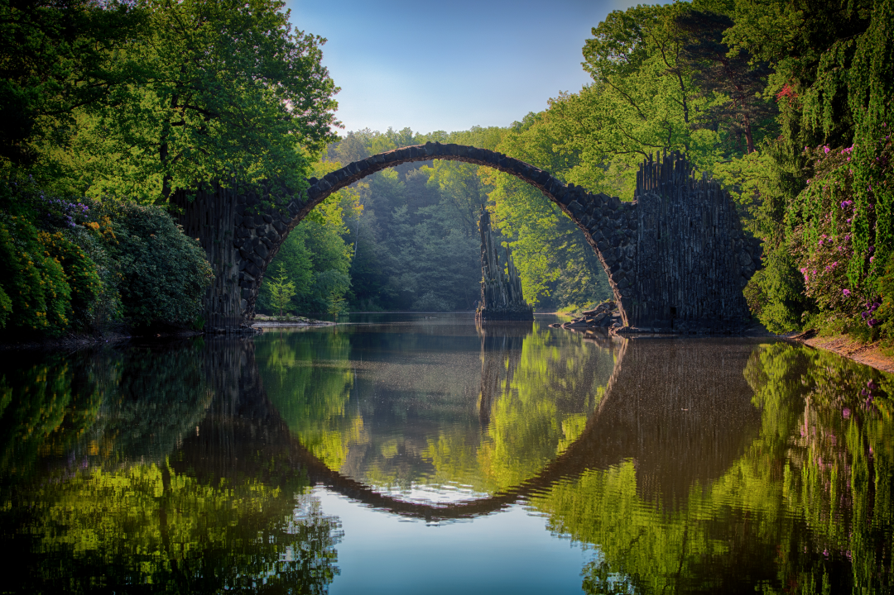
    <br>
    <em><strong>Original image</strong></em>
    <br><br>
    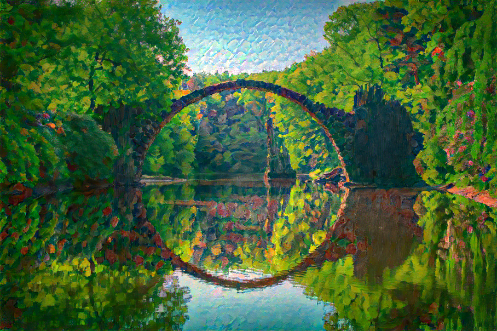
    
    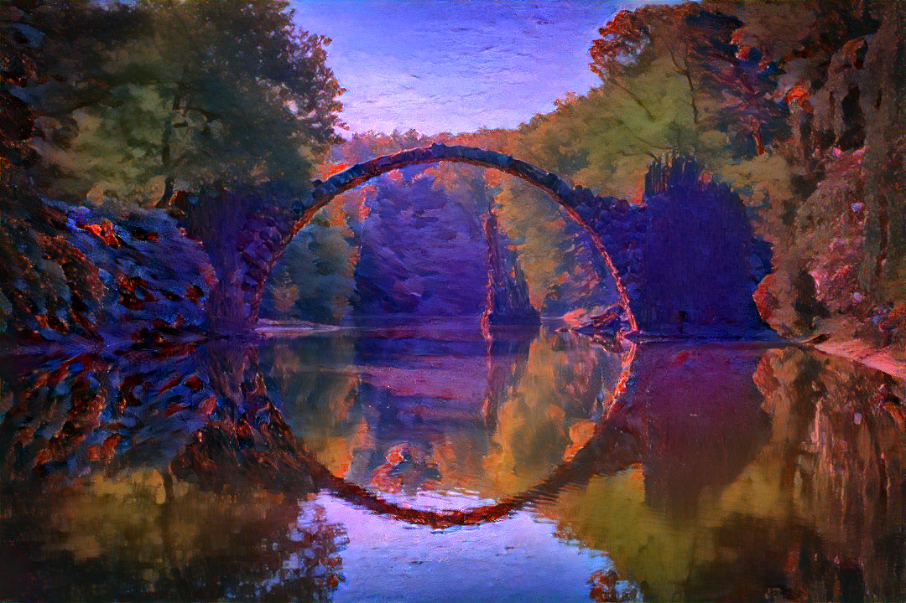
    
    <br>
    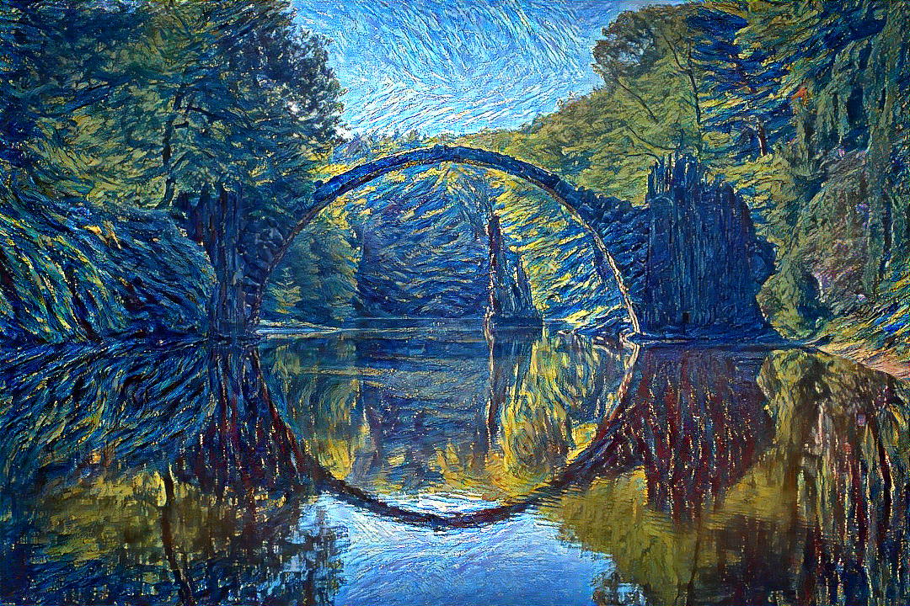
    
    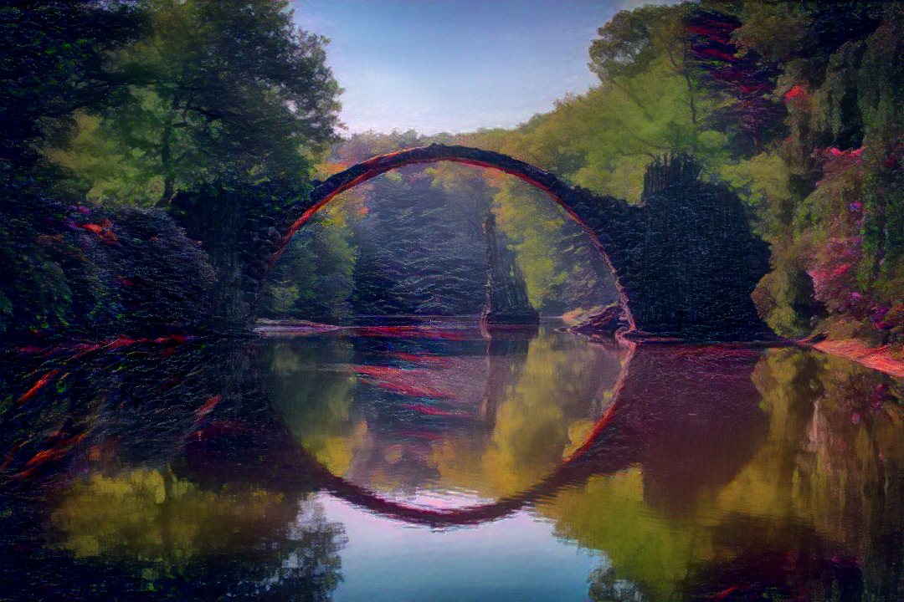
    
    <br>
    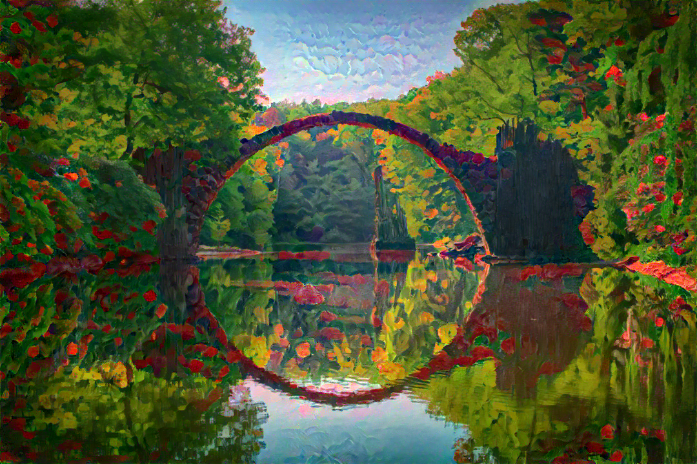
    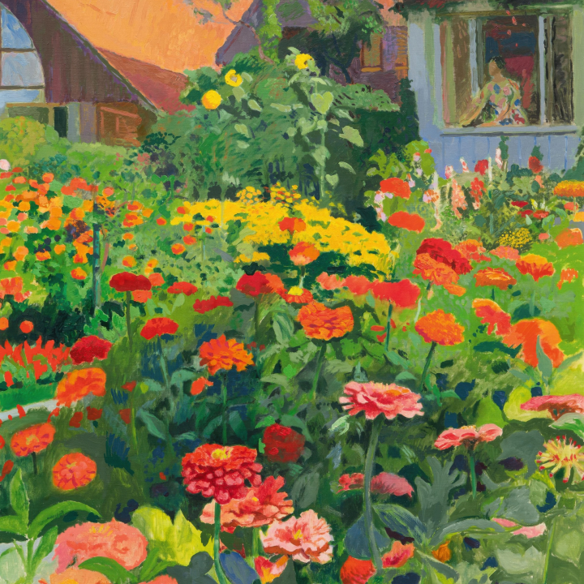
    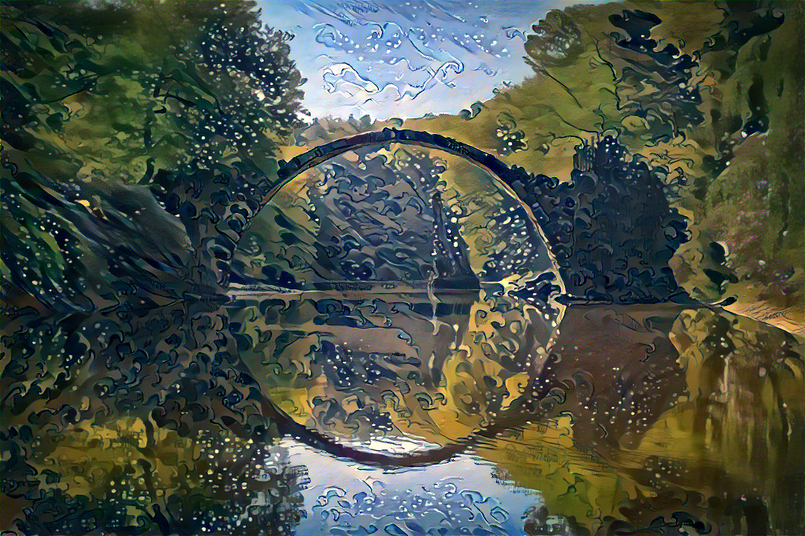
    
    <br>
    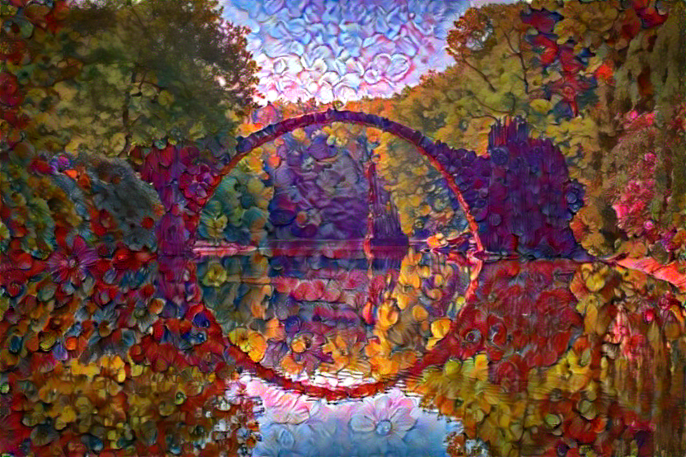
    
    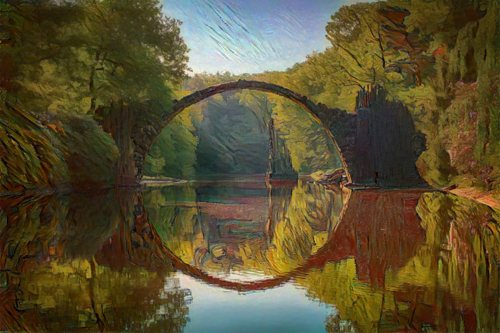
    
    <br>
    <em><strong>Images after Neural Style Transfer</strong></em>
</p>

I adjusted the resolution of the content image to $1080 \times 720$ and the style image to $720 \times 720$. This allows
it to run successfully on my laptop with an NVIDIA GeForce RTX 5060 laptop GPU (8GB VRAM).

## An overview of NST

### What is Neural Style Transfer algorithm?

Neural Style Transfer (NST) is a technique that generates a new image by combining the content of one image (the content
image) with the style of another (the style image). The content image defines the spatial layout and semantic
structure of objects, while the style image contributes color, texture, and brushstroke patterns.

<br>
<p align="center">
    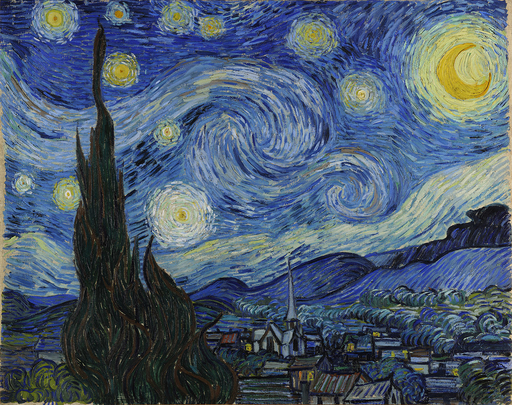
    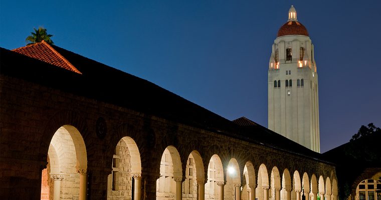
    <br>
    
</p>

### Problem definition

Given two input images:

- A content image $I_c$, which provides the spatial structure, layout, and objects that should be preserved
- A style image $I_s$, which contributes the textures, colors, and artistic patterns to be transferred

The objective is to synthesize a generated image $I_g$ such that:

- The structural and semantic content in $I_g$ resembles that of $I_c$
- The visual appearance (in terms of style) of $I_g$ matches that of $I_s$

This is accomplished by optimizing a loss function that balances content and style terms. The resulting image $I_g$ is
computed iteratively so that it matches the high-level features of the content image while reproducing the statistical
patterns (style) extracted from the style image.

### CNN Network as a Feature Extractor

Neural style transfer relies on the hierarchical representation capabilities of convolutional neural networks (CNNs),
such as *VGG-19* pretrained on the ImageNet dataset. These networks extract multi-scale features from images, which are
useful for encoding both spatial content and visual style.

- Lower (or upstream) convolutional layers tend to capture local structures, such as edges, textures, and basic color
  contrasts
- Higher (or downstream) convolutional layers encode more abstract representations, including object shapes, part
  relationships, and spatial configurations

<br>
<p align="center">
    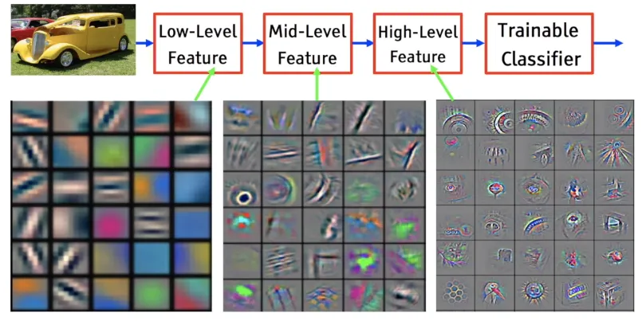
</p>

As the input passes through successive convolutional layers, the learned filters progress from detecting simple oriented
edges, to combinations of edges forming parts, to high-level object models — each level providing a richer
semantic abstraction of the input.

Because of this hierarchy, intermediate feature maps extracted from different layers of a CNN can be used to
characterize the content and style of an image:

- Content features are drawn from deeper layers, where spatial semantics are preserved
- Style features are obtained by computing feature correlations (e.g., via Gram matrices) across multiple layers,
  capturing texture and appearance

While this interpretation is not mathematically rigorous in a strict sense, it is strongly supported by empirical
results across many experiments. In practice, this layer-wise disentanglement of content and style forms the foundation
for neural style transfer.

### Overall Process

#### <em>Step 1: Select a pretrained CNN</em>

- Use a fixed, pretrained convolutional neural network such as VGG‑19, trained on ImageNet
- The network serves as a feature extractor; its weights remain unchanged during the optimization process

#### <em>Step 2: Extract features from the content and style images</em>

- Feed the content image $I_c$ and the style image $I_s$ independently through identical copies of the pretrained
  network
- Content features are extracted from deeper layers (e.g., ```Conv4_2```) that preserve spatial structure and object
  layout
- Style features are extracted from multiple shallower and intermediate layers (e.g., ```Conv1_1```, ```Conv2_1```,
  ```Conv3_1```, ```Conv4_1```, ```Conv5_1```), where texture and low-level statistics are more prominent

#### <em>Step 3: Initialize the generated image</em>

- Create the generated image $I_g$ as a randomly initialized image (e.g., white noise or a copy of $I_c$)
- Unlike $I_c$ and $I_s$, the generated image $I_g$ is the only input that will be updated through gradient-based
  optimization

#### <em>Step 4: Optimization loop</em>

- Foward $I_g$ through the same pretrained network to compute its content and style features
- Compute the content loss of $I_g$ with those of $I_c$
- Compute the style loss of $I_g$ and $I_s$ across selected layers
- Backpropagate the total loss with respect to the pixels of $I_g$
- Update $I_g$ using an optimizer such as L-BFGS or Adam
- Repeat this process for a fixed number of iterations or until convergence

#### <em>Step 5: Result</em>

After optimization, the resulting image $I_g$ will combine:

- The structural content of $I_c$, and
- The visual style of $I_s$

This synthesis is achieved by aligning intermediate representations of $I_g$ with those of both $I_c$ and $I_s$ through
loss minimization.

### Loss Function in Neural Style Transfer

In neural style transfer, the optimization of the generated image relies on carefully defined loss functions. These
guide the synthesis toward blending content from one image with the artistic style of another. This section outlines
each component of the loss and explains how they are combined and optimized.

We use VGG-19 pretrained on ImageNet as our feature extractor. Let:

- $x$ denote an input image
- $F_l(x) \in \mathbb{R}^{C_l \times H_l \times W_l}$ denote the feature map at layer $l$, where $C_l$ is the number of
  channles, and $H_l$, $W_l$ are the spatial dimensions

We reshape this to $F_l(x) \in \mathbb{R}^{C_l \times N_l}$, where $N_l = H_l \times W_l$

- Lower layers (e.g., ```relu1_1```) encode fine-grained spatial detail
- Higher layers (e.g., ```relu4_2```) encode semantic, structural content

#### <em>Content Representation</em>

The content of an image is encoded in the high-level feature activations. Given a content image $I_c$ and a generated
image $I_g$, the content loss measures the distance between their feature activations at layer $l$:

$$\mathcal{L}_{content}(I_g, I_c) = \frac{1}{2} \sum_{i,j} (F_{ij}^l(I_g) - F_{ij}^l(I_c))^2$$

This loss encourages the generated image $I_g$ to preserve the semantic structure of the content image $I_c$.
Importantly, it is computed in feature space, not pixel space.

#### <em>Style Representation via Gram Matrices</em>

Style is not a spatially localized property — it manifests as texture statistics that should be position-invariant. We
capture this by computing pairwise feature correlations across spatial positions.

<strong>*The Gram Matrix*</strong>

Given the feature map $F_l(I) \in \mathbb{R}^{C_l \times H_l \times W_l}$ at layer $l$, we first flatten the spatial
dimensions to obtain $F_l(I) \in \mathbb{R}^{C_l \times N_l}$, where $N_l = H_l \times W_l$. The gram
matrix $G_l(I) \in \mathbb{R}^{C_l \times C_l}$ is then defined as:

$$G_{ij}^l(I) = \frac{1}{N_l} \sum_{k=1}^{N_l} F_{ik}^l(I) \cdot F_{jk}^l(I)$$

or equivalently in matrix form:

$$G_l(I) = \frac{1}{N_l} F_l(I) \left( F_l(I) \right)^T$$

Intuitively, $G_{ij}^l$ measures how much feature channels $i$ and $j$ co-activate across all spatial positions. This
operation discards spatial layout entirely while preserving the co-occurrence statistics of features — precisely what
characterizes texture and artistic style.

Note the normalization factor $\frac{1}{N_l}$: without it, the Gram matrix magnitude grows with image resolution, making
the style loss resolution-sensitive and difficult to tune consistently.

<strong>*Style Loss*</strong>

The style loss at layer $l$ is then the squared Frobenius norm between the Gram matrices of the generated image $I_g$
and the style image $I_s$:

$$\mathcal{L}_{style}^l(I_g, I_s) = \frac{1}{4 C_l^2 N_l^2} \left\| G_l(I_g) - G_l(I_s) \right\|_F^2$$

The total style loss aggregates contributions across a set of layers $\mathcal{L}_s$ with per-layer weights $w_l$:

$$\mathcal{L}_{style}(I_g, I_s) = \sum_{l \in \mathcal{L}_s} w_l L_{style}^l(I_g, I_s)$$

Using multiple layers is critical: lower layers capture fine-grained texture (brushstroke-level patterns), while higher
layers encode coarser compositional and color distributions. The choice of $\mathcal{L}_s$ and the weights $w_l$
therefore directly controls the granularity of the transferred style.

<strong>*Total Variation Loss*</strong>

Optimization may introduce high-frequency noise in $I_g$. This is mitigated by the total variation (TV) loss, which
encourages spatial smoothness by penalizing large intensity differences between neighboring pixels:

$$\mathcal{L}_{TV}(I_g) = \sum_{i,j} \left( |I_g(i, j+1) - I_g(i, j)| + |I_g(i+1, j) - I_g(i, j)| \right)$$

or

$$\sum_{i,j} \left( \|x_{i, j+1} - x_{i, j}\| + \|x_{i+1, j} - x_{i, j}\| \right)$$

Unlike the squared (L2) variant, the L1 formulation does not overly suppress large local differences — it tolerates
sharp edges and object boundaries while still discouraging fine-grained high-frequency noise. This property is desirable
in style transfer, where perceptually meaningful discontinuities (e.g., outlines of objects) should be preserved in the
generated image.

<strong>*Combined Loss and Optimization*</strong>

The total loss combines content, style, and total variation components:

$$\mathcal{L}_{total} = \alpha \mathcal{L}_{content} + \beta \mathcal{L}_{style} + \gamma \mathcal{L}_{TV}$$

where:

- $alpha$: weight for preserving content
- $beta$: weight for applying style
- $gamma$: weight for smoothing artifacts

During training:

1. Initialize $I_g$ (e.g., with white noise or a copy of $I_c$)
2. Keep all CNN weights fixed
3. Compute each loss via forward passes
4. Backpropagate gradients with respect to $I_g$ only
5. Update $I_g$ using an optimizer
6. Repeat until synthesis achieves a satisfactory blend of content, style, and smoothness

## Acknowledgement
- [Style Transfer](https://i-systems.github.io/teaching/DL/iNotes/18_Style_Transfer.html)
- [pytorch-neural-style-transfer](https://github.com/gordicaleksa/pytorch-neural-style-transfer)
